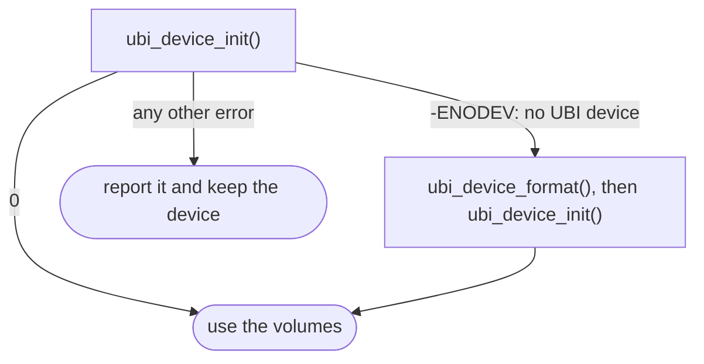

# Examples

The contract of every call is in
[include/ubi/ubi.h](https://github.com/kamil-kielbasa/zephyr-ubi/blob/main/include/ubi/ubi.h),
and [`samples/basic`](https://github.com/kamil-kielbasa/zephyr-ubi/tree/main/samples/basic)
is a complete program for `native_sim` and the nRF5340 DK.

## Adding it to a project

In the west manifest:

```yaml
manifest:
  projects:
    - name: zephyr-ubi
      url: https://github.com/kamil-kielbasa/zephyr-ubi
      revision: main
      path: modules/lib/zephyr-ubi
```

In `prj.conf`:

```ini
CONFIG_UBI=y
CONFIG_MBEDTLS=y
CONFIG_MBEDTLS_PSA_CRYPTO_C=y

# The handle, a scratch buffer and about 8 bytes per erase block.
CONFIG_HEAP_MEM_POOL_SIZE=8192
```

UBI manages one fixed partition from the devicetree.

## Attaching

```c
#include <psa/crypto.h>
#include <ubi/ubi.h>

static const struct ubi_config cfg = {
	.flash_area_id = PARTITION_ID(storage_partition),
	.ikm_key_id    = DEVICE_IKM_KEY_ID,	/* see below */
	.event_cb      = on_event,
	.state_cb      = on_state,		/* see Security */
};

static int attach(struct ubi_device *ubi)
{
	int ret = ubi_device_init(ubi, &cfg);

	/* Format only a partition without a UBI device. */
	if (-ENODEV != ret)
		return ret;

	ret = ubi_device_format(&cfg);

	if (0 != ret)
		return ret;

	return ubi_device_init(ubi, &cfg);
}
```

Allocate the handle with `k_calloc(1, ubi_device_size())`, after
`psa_crypto_init()`. Format only after `-ENODEV`; for every other result see
[Operations](operations.md#when-an-attach-fails).



## Volumes and blocks

Volume identifiers are not kept across a format, so look volumes up by name
after each attach:

```c
static int logs_open(struct ubi_device *ubi, uint32_t *vol_id)
{
	const struct ubi_volume_config logs = { .name = "logs", .leb_count = 8 };
	const int ret = ubi_volume_find(ubi, logs.name, vol_id);

	if (-ENOENT != ret)
		return ret;

	return ubi_volume_create(ubi, &logs, vol_id);
}
```

`ubi_leb_change(ubi, vol_id, lnum, data, size)` replaces the whole LEB, and
`ubi_leb_read(ubi, vol_id, lnum, offset, buffer, size)` reads any part of it.
Bytes never written read as erased.

## Appending records

`ubi_leb_write_at()` stores no length, so the application keeps its own
offset, in whole write blocks. `leb_size` comes from `ubi_device_get_info()`:

```c
static int record_append(struct ubi_device *ubi, uint32_t vol_id,
			 const uint8_t *record, size_t size, uint32_t *offset)
{
	int ret = 0;

	/* The block is full: start again on a fresh one. */
	if (*offset + size > leb_size) {
		ret = ubi_leb_erase(ubi, vol_id, 0);

		if (0 != ret)
			return ret;

		*offset = 0;
	}

	ret = ubi_leb_write_at(ubi, vol_id, 0, *offset, record, size);

	if (0 == ret)
		*offset += size;

	return ret;
}
```

Writes go in rising order until the LEB is changed, unmapped or erased; the
example erases the LEB when it is full. After a reboot the application finds
the end of its records: bytes past the last one read as erased.

## Provisioning the key

Import the keying material once, during production, as a persistent key under
an identifier fixed for the product. The material comes from your
provisioning system and should differ between devices:

```c
#include <zephyr/psa/key_ids.h>

#define DEVICE_IKM_KEY_ID ZEPHYR_PSA_APPLICATION_KEY_ID_RANGE_BEGIN

static int ikm_provision(const uint8_t *material, size_t size)
{
	psa_key_attributes_t attributes = PSA_KEY_ATTRIBUTES_INIT;
	psa_key_id_t key_id = PSA_KEY_ID_NULL;
	psa_status_t status =
		psa_get_key_attributes(DEVICE_IKM_KEY_ID, &attributes);

	psa_reset_key_attributes(&attributes);

	/* Provisioned on an earlier boot, or the key store is failing. */
	if (PSA_ERROR_INVALID_HANDLE != status)
		return (PSA_SUCCESS == status) ? 0 : -EIO;

	psa_set_key_id(&attributes, DEVICE_IKM_KEY_ID);
	psa_set_key_lifetime(&attributes, PSA_KEY_LIFETIME_PERSISTENT);
	psa_set_key_type(&attributes, PSA_KEY_TYPE_DERIVE);
	psa_set_key_usage_flags(&attributes, PSA_KEY_USAGE_DERIVE);
	psa_set_key_algorithm(&attributes, PSA_ALG_HKDF(PSA_ALG_SHA_256));

	status = psa_import_key(&attributes, material, size, &key_id);
	psa_reset_key_attributes(&attributes);

	return (PSA_SUCCESS == status) ? 0 : -EIO;
}
```

Wipe the material from RAM once it is imported. The key cannot be exported,
not even by UBI. A key that is never needed outside the device can instead be
generated on it, with `psa_generate_key()`, the same attributes and a size of
256 bits. A key derived from a hardware unique key also works, if its policy
allows `PSA_KEY_USAGE_DERIVE` with `PSA_ALG_HKDF(PSA_ALG_SHA_256)`.

If the key is lost, so is the partition: every attach returns `-EBADMSG`. A
second partition under the same key needs its own `key_context`:

```c
static const uint8_t scratch_context[] = "scratch";

static const struct ubi_config scratch_cfg = {
	.flash_area_id    = PARTITION_ID(scratch_partition),
	.ikm_key_id       = DEVICE_IKM_KEY_ID,
	.key_context      = scratch_context,
	.key_context_size = sizeof(scratch_context) - 1,
	.event_cb         = on_event,
	.state_cb         = on_state,
};
```

## Maintenance on a work queue

Run maintenance on a work queue of its own: a UBI call needs up to 2 KiB of
stack, more than the system work queue has by default.

```c
K_THREAD_STACK_DEFINE(maintenance_stack, 4096);
static struct k_work_q maintenance_queue;

static void maintenance_run(struct k_work *work)
{
	static const enum ubi_maintenance_op ops[] = {
		UBI_MAINTENANCE_RECLAIM,
		UBI_MAINTENANCE_RELOCATE,
	};
	struct k_work_delayable *self = k_work_delayable_from_work(work);
	struct ubi_maintenance_result result = { 0 };
	uint32_t remaining = 0;

	for (size_t i = 0; i < ARRAY_SIZE(ops); ++i) {
		const int ret = ubi_maintenance(ubi, ops[i], 1, &result);

		if (0 != ret) {
			LOG_ERR("maintenance %d failed (%d)", ops[i], ret);
			return;
		}

		remaining += result.remaining;
	}

	k_timeout_t delay = K_SECONDS(60);

	/* Come back soon while work is left. */
	if (0 != remaining)
		delay = K_MSEC(100);

	k_work_reschedule_for_queue(&maintenance_queue, self, delay);
}

static K_WORK_DELAYABLE_DEFINE(maintenance_work, maintenance_run);
```

Start it after the attach, and cancel it with `k_work_cancel_delayable_sync()`
before `ubi_device_deinit()`. When to run repair and discard:
[Operations](operations.md#keeping-maintenance-up).
