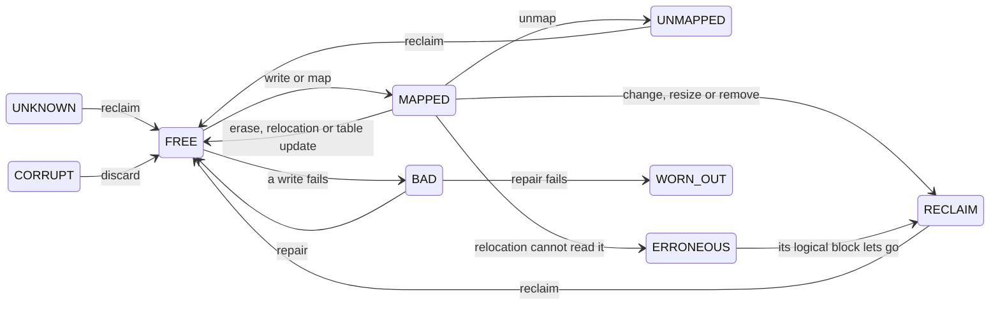
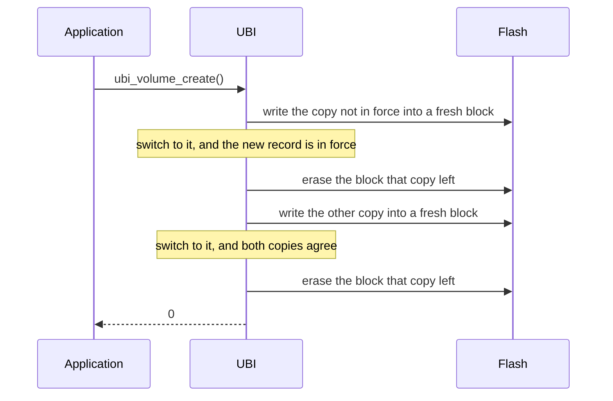

# How it works

## Logical and physical blocks

A **physical erase block** (PEB) is one erase unit of the flash. A **logical
erase block** (LEB) is what a volume addresses. The application writes to
volume 3, block 7; UBI picks the PEB and moves it when that serves the flash
better. The mapping lives in RAM and is rebuilt from the headers at every
attach.

A LEB is smaller than a PEB by the two 64-byte headers in front of the data.

## Block states

Every PEB is in one of nine states, held in RAM only:

| state | meaning |
|---|---|
| `UNKNOWN` | no usable erase counter header; reclaim makes it free |
| `FREE` | erased and stamped with its erase count |
| `MAPPED` | backs a logical block |
| `ERRONEOUS` | backs a logical block relocation could not read; left in place |
| `RECLAIM` | contents dead, waiting for an erase |
| `UNMAPPED` | let go of by an unmap, erased after the dead ones |
| `CORRUPT` | damaged behind a valid erase counter header, kept unread |
| `BAD` | failed a write or an erase, gets one more chance |
| `WORN_OUT` | failed again, out of service until the next attach |

A block that failed a write may work after a power cycle, so retirement is
never written down. A failed erase is different: the block still holds what it
held, and flash has no way to mark it bad. The device turns read-only until the
next attach; reads carry on and every call that would write returns `-EROFS`.

A block whose erase counter header verifies but whose volume identifier header
does not is judged by its data area. All erased means a write cut short, safe
to erase. Anything else is kept as `CORRUPT` until `UBI_MAINTENANCE_DISCARD`,
so the only copy of what it holds is not destroyed. Attach refuses the
partition once corrupt blocks reach a twentieth of its good blocks, rounded
down, or eight when that is zero.

## Attach

Attach reads the flash twice, decides in RAM and writes nothing.

The **first pass** reads the headers of every block. It records erase counts,
the highest sequence number, and which blocks hold the volume table. A block
without a usable erase counter header is `UNKNOWN` and gets the mean erase
count of the others. A block that cannot be read stops the attach with `-EIO`:
it may hold the newest copy of something.

Then one of the two **volume table** copies is adopted: the newer by sequence
number, if it is sealed, its data matches the seal, its record verifies and it
belongs to its header's image. The older copy stands in for a newer one that
was cut short or damaged, never for one that cannot be read or that a newer
release wrote, which may be the table in force. A table resting on one copy is
reported with `UBI_EVENT_VOLUME_TABLE_DEGRADED`; any stale copy is dropped.

The **second pass** hangs every block off the logical block its header names.
Blocks of another image become `UNKNOWN`. A block naming a volume or block the
table does not describe is an orphan, queued for reclaim and reported, unless a
removal or a shrink left it.

### Duplicates

A power loss during an update can leave two blocks naming the same logical
block. The higher sequence number wins, unless the newer block is sealed and
its data fails the checksum in its header: then it loses and is reported with
`UBI_EVENT_DATA_CORRUPT`. This is what makes `ubi_leb_change()` atomic. A
sealed block that fails its checksum with no older copy behind it is kept and
reported: dropping it would lose every byte that did reach the flash.

## Writing

`ubi_leb_change()` writes the header and data into a free block and moves the
mapping once they are down. The old block goes to `RECLAIM`. A block that
fails the write is erased and retired, so nothing half written survives. A
logical block with no contents yet has nothing to fall back to: a first change
cut short leaves what reached the flash, reported at the next attach.

`ubi_leb_write_at()` appends at the offset given, with no seal. It maps the
block on first use and trusts the caller: it does not stop overlapping writes,
remember the append frontier or notice a torn record.

`ubi_leb_unmap()` drops the mapping in RAM and writes nothing. Until reclaim
erases the block, the next attach maps it back with the contents it had when
unmapped, never older ones. Reclaim erases dead copies first, then an unmapped
block together with every other copy of its logical block.

`ubi_leb_erase()` erases every older copy of the block still waiting for
reclaim, then the block itself. None of them comes back after a reboot, and an
erase cut short can bring back only the newest contents.

## Volume table updates

The volume table is two copies of one record. An update writes each copy into
a fresh block and moves its mapping, first the copy not in force, then the
other, and erases the block each one leaves. The new record is in force once
the first copy is down. No copy is ever overwritten, so an update cut short
leaves the old record or the new one, and the table wears like any other data.

## Erasing

An erase cut short can leave both headers intact over data that is partly
gone. Before each erase, UBI zeroes the magic of every header that still
verifies, the erase counter header first, so such a block has no header left
and is erased again before use. The erase count is kept in RAM and goes into
the fresh header.

Flash with ECC refuses the second write. UBI then logs it once and erases
without it until the next attach; `CONFIG_UBI_ERASE_INVALIDATES_HEADERS=n`
skips the attempt.

## Allocation

A write takes the most worn free block within
`CONFIG_UBI_WEAR_LEVELING_THRESHOLD` erases of the least worn one, so neither
the freshest nor the most worn block takes every write. Three blocks are held
back from volumes: two for the volume table and one spare for its updates.
When no block is free, the write erases one itself, so a device that never
runs reclaim still works, one erase per write slower.

## Maintenance

Nothing runs in the background. `ubi_maintenance()` takes an operation and a
budget in units of work, and reports what it did and what is left.

- **`UBI_MAINTENANCE_RECLAIM`** erases dead blocks and stamps them. A full
  free pool makes writes erase-free.
- **`UBI_MAINTENANCE_RELOCATE`** levels wear. It picks the block to move onto
  first, and moves the least worn block in use when the gap to it exceeds the
  threshold. The data is copied up to its last written byte, sealed afresh,
  read back and compared before the mapping moves. A block that cannot be read
  stays where it is as `ERRONEOUS`. A freshly handed out block is left alone
  for `CONFIG_UBI_PROTECTION_CYCLES` erases, since its data is likely to be
  rewritten soon.
- **`UBI_MAINTENANCE_REPAIR`** brings the volume table copies back into
  agreement and gives retired blocks another chance. A block that fails that
  chance is written off, not reported as an error.
- **`UBI_MAINTENANCE_DISCARD`** erases the `CORRUPT` blocks and returns them
  to service.

## Callbacks

Both are required, so ignoring what UBI finds is a decision written in code.

The **event callback** reports damage as it is found: a header failing its CRC
or its MAC, a lost volume table copy, an orphan, a retired block, a sealed
block whose data fails its checksum.

The **state callback** decides whether to trust the device, at the end of
every attach and every `CONFIG_UBI_STATE_CHECK_INTERVAL` flash writes. It runs
before the write it guards, so a refusal leaves nothing written. Rollback
detection belongs here; see [Security](security.md).

Both run on the calling thread with the device locked. They must not block,
and a call back into UBI returns `-EDEADLK`.

## Relation to Linux UBI

The headers are Linux's, field for field, with the MAC in space Linux leaves as
padding. The attach, duplicate resolution, erase ordering, wear levelling,
protection of fresh blocks, preservation of corrupt blocks and the read-only
state after a failed erase follow Linux UBI on NOR flash.

Not ported: static volumes, fastmap, the background thread and scrubbing as a
separate operation. Added: authenticated metadata, the events that come with
it, and the state callback.

The defaults differ: a wear levelling threshold of 256 against Linux's 4096,
suited to flash rated for fewer erase cycles, and a protection window of 64
erases against 10, since a tighter threshold relocates more often.
