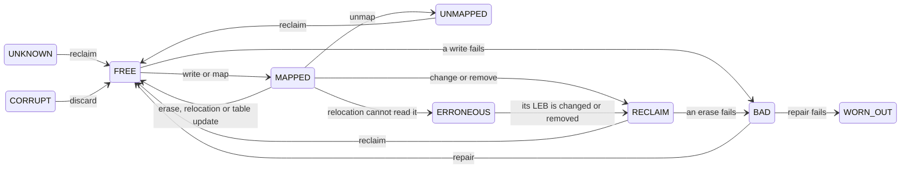
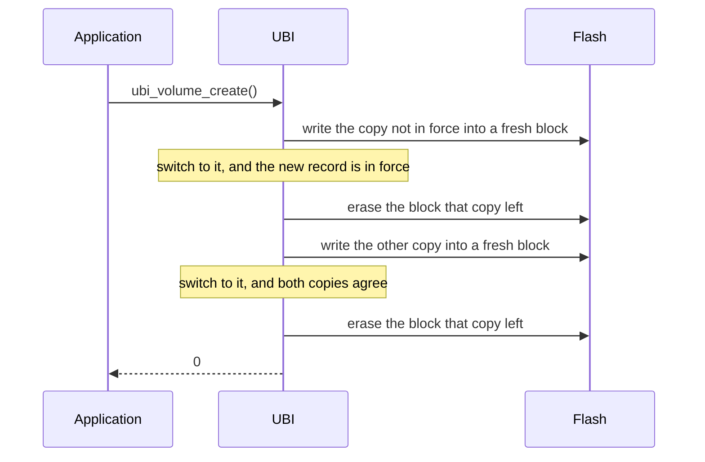

# How it works

## Logical and physical blocks

Flash is erased in blocks: a byte that holds data has to be erased before it
is written again, and an erase clears the whole block around it. UBI calls
these blocks **physical erase blocks** (PEBs). A 1 MiB partition with 4 KiB
erase blocks has 256 PEBs. Below, a *block* is a PEB.

A **volume** is a row of **logical erase blocks** (LEBs), numbered from 0.
The application reads and writes LEBs, and UBI decides which PEB holds each
one. The application never sees PEB numbers, so UBI can move a LEB: a changed
LEB goes to a fresh PEB, and wear levelling moves data that does not change.

| volume | LEB | held in |
|---|---|---|
| `config` | 0 | PEB 12 |
| `config` | 1 | PEB 3 |
| `logs` | 0 | PEB 40 |
| `logs` | 1 | no PEB: reads as erased |

Each PEB starts with two 64-byte headers:

- the **erase counter header**, written after every erase, holds how many
  times the PEB has been erased;
- the **volume identifier header**, written with the data, names the volume
  and the LEB the PEB holds. Its sequence number grows with every header
  written, so of two copies of a LEB the newer one is known.

The rest of the PEB holds the LEB's data, so a LEB is 128 bytes smaller than a
PEB. The map from LEBs to PEBs is kept in RAM, and every attach rebuilds it
from the headers. The layout is in [On-flash format](on-flash-format.md).

## Block states

UBI keeps a state for every block, in RAM only:

| state | meaning |
|---|---|
| `UNKNOWN` | holds nothing UBI can use; reclaim makes it free |
| `FREE` | erased, with a new erase counter header |
| `MAPPED` | holds a LEB |
| `ERRONEOUS` | holds a LEB that relocation could not read; left in place |
| `RECLAIM` | old contents, waiting for an erase |
| `UNMAPPED` | released by an unmap; erased after the `RECLAIM` blocks |
| `CORRUPT` | data behind a damaged volume identifier header; kept until discard |
| `BAD` | failed a write or an erase; repair gives it one more chance |
| `WORN_OUT` | failed again, out of service until the next attach |

## Attach

Attach reads the flash in two passes and writes nothing.

The **first pass** reads the headers of every block. It records the erase
counts, the highest sequence number and the blocks that hold the volume
table. A block without a usable erase counter header becomes `UNKNOWN`; once
the pass is over, it is given the mean erase count of the others. Damaged
headers are handled as in [Damaged headers](#damaged-headers).

A block that cannot be read stops the attach with `-EIO`. It might hold the
newest copy of a LEB or of the volume table, and attaching without it could
serve an older copy instead. Try again; if the error persists, the flash is
faulty.

Next, attach picks one of the two **volume table** copies: the newer one, if
its data checksum and its MAC verify and it belongs to this image. The older
copy is used only when the newer one was cut short or damaged. If the newer
copy cannot be read, or a newer release wrote it, attach stops, because it may
be the table in force. A table with only one usable copy is reported with
`UBI_EVENT_VOLUME_TABLE_DEGRADED`.

The **second pass** maps every block to the LEB its header names. Blocks left
by an earlier format become `UNKNOWN`. A block that names a volume or LEB the
table does not describe is queued for reclaim. If its volume was never
created, it is also reported with `UBI_EVENT_LEB_ORPHANED`.

### Duplicates

A power cut during an update can leave two blocks that name the same LEB. The
block with the higher sequence number wins. If that block has a data checksum
and its data does not match, the older block wins instead, and the newer one
is reported with `UBI_EVENT_DATA_CORRUPT`. This is what makes
`ubi_leb_change()` atomic. A block whose data fails its checksum, with no
older copy, is kept and reported: dropping it would lose all the data that
reached the flash.

## Damaged headers

A header that fails its CRC is reported with `UBI_EVENT_HDR_CORRUPT`, and one
that fails its MAC with `UBI_EVENT_HDR_TAMPERED`. What attach does next
depends on which header it is.

A damaged **erase counter header** leaves nothing on the block to trust. The
block becomes `UNKNOWN`, and reclaim erases it.

A valid erase counter header over a damaged **volume identifier header** says
that the block belongs to this device, but not which LEB it holds. Attach
reads the data area:

- all erased: a write was cut short, and nothing is lost. The block becomes
  `UNKNOWN`, and reclaim erases it.
- data present: the block becomes `CORRUPT`. UBI never maps it, but does not
  erase it either, since its data may be the only copy of a LEB. It stays
  until the application runs `UBI_MAINTENANCE_DISCARD`.

This is not a security hole. The data of a `CORRUPT` block never reaches the
application, and a header cannot be forged without the key: damaging a header
can destroy data, but cannot slip other data in. Attach refuses the partition
once corrupt blocks reach a twentieth of its good blocks, rounded down, or
eight when that is zero. What UBI protects is in [Security](security.md).

## Writing

The contract of each call is in
[include/ubi/ubi.h](https://github.com/kamil-kielbasa/zephyr-ubi/blob/main/include/ubi/ubi.h);
this section shows how the calls work.

`ubi_leb_change()` writes the header and the data into a free block, then
switches the LEB to it. The old block goes to `RECLAIM`. A block that fails
the write is erased and retired, so nothing half-written stays behind. A LEB
with no contents yet has nothing to fall back to: a first change cut short
leaves the part that reached the flash, reported at the next attach.

`ubi_leb_write_at()` writes at the given offset, without a checksum. It maps
the LEB on first use. It does not stop overlapping writes, remember where the
data ends, or detect a torn record.

`ubi_leb_unmap()` changes the map in RAM and writes nothing. Until the old
block is erased, the next attach maps it back with the contents it had when
unmapped, never older ones. Reclaim erases the `RECLAIM` blocks first, then
an `UNMAPPED` block together with every other old copy of its LEB.

`ubi_leb_erase()` erases the old copies of the LEB first, then its current
block. None of them comes back after a reboot, and an erase cut short can
bring back only the newest contents.

## Volume table updates

The volume table is stored twice. An update writes each copy into a fresh
block and erases the block that copy leaves: first the copy not in force, then
the other. The new table is in force as soon as the first copy is written. No
copy is ever overwritten, so an update cut short leaves the old table or the
new one, and the table blocks wear like any other. Three blocks are kept out
of the volumes: two for the table copies and one spare for their updates.

## Erasing

An erase cut short can leave both headers intact while part of the data is
gone. So before each erase, UBI zeroes the magic number of every valid header,
the erase counter header first. A block whose erase was cut short then has no
valid header and is erased again before use. The erase count is kept in RAM and
written into the new header.

Flash with ECC refuses to write over the magic. UBI then logs it once and
erases without zeroing until the next attach;
`CONFIG_UBI_ERASE_INVALIDATES_HEADERS=n` skips the attempt. An erase that
fails is covered in [Bad blocks](#bad-blocks).

## Bad blocks

A block that fails a write is **retired**: UBI erases it, stops using it and
reports `UBI_EVENT_PEB_BAD`. The flash cannot mark a block bad, and a block
that failed once may work after a power cycle, so retirement is kept in RAM
only. `UBI_MAINTENANCE_REPAIR`, or the next attach, gives the block another
chance; one that fails the repair is `WORN_OUT` until the next attach.

A failed erase is different: the block may still hold its old data, and the
flash cannot mark it bad. The block is retired and the device becomes
read-only until the next attach: reads work, and every call that would write
returns `-EROFS`.

## Wear levelling

Each block takes a limited number of erases, so UBI spreads them out.

A write takes the most worn free block whose erase count is below the lowest
free one plus `CONFIG_UBI_WEAR_LEVELING_THRESHOLD`. With free blocks erased
10, 50, 120 and 400 times and a threshold of 256, the limit is 266, so the
write takes the block erased 120 times. New data tends to change soon, so it
goes to a worn block, and the least worn blocks are kept for data that stays.

Data that does not change keeps its block from being erased while the others
wear. `UBI_MAINTENANCE_RELOCATE` moves it. It picks a free block by the same
rule with twice the threshold; if the least worn block in use is more than the
threshold behind it, that block's LEB is copied onto the free block, and the
old block is erased. A newly written block is left alone for the next
`CONFIG_UBI_PROTECTION_CYCLES` erases, since its data is likely to change
soon.

## Maintenance

Released blocks are erased, and wear is levelled, when the application calls
`ubi_maintenance()`. Each call runs one operation for up to a budget of steps,
and reports the steps done and left. A write that finds no free block erases
one itself, so a device that never runs reclaim still works, one erase per
write slower.

- **`UBI_MAINTENANCE_RECLAIM`** erases released blocks and returns them to
  the free pool. With a full free pool, writes need no erase.
- **`UBI_MAINTENANCE_RELOCATE`** moves one LEB per step, as in
  [Wear levelling](#wear-levelling). The data is copied up to its last written
  byte with a new checksum, read back and compared before the LEB switches
  over. A block that cannot be read stays where it is as `ERRONEOUS`.
- **`UBI_MAINTENANCE_REPAIR`** rewrites the volume table when its copies
  differ, and gives [retired blocks](#bad-blocks) another chance. A block
  that fails again becomes `WORN_OUT`; this is not an error.
- **`UBI_MAINTENANCE_DISCARD`** erases the `CORRUPT` blocks and returns them
  to service.

## Callbacks

Both callbacks are required, so ignoring what UBI finds has to be written in
code.

The **event callback** reports damage when UBI finds it: a header that fails
its CRC or MAC, an unusable volume table copy, an orphan block, a retired
block, or data that fails its checksum.

The **state callback** decides whether to trust the device, at the end of
every attach and every `CONFIG_UBI_STATE_CHECK_INTERVAL` flash writes. It runs
before the write, so a refusal leaves nothing written. Rollback detection goes
here; see [Security](security.md).

Both run on the calling thread with the device locked. They must not block,
and a call back into UBI returns `-EDEADLK`.

## Relation to Linux UBI

The headers follow Linux UBI field by field, with the MAC in space that Linux
leaves as padding. Attach, duplicate resolution, erase ordering, wear
levelling, protection of new blocks, keeping corrupt blocks and the read-only
state after a failed erase follow Linux UBI on NOR flash.
